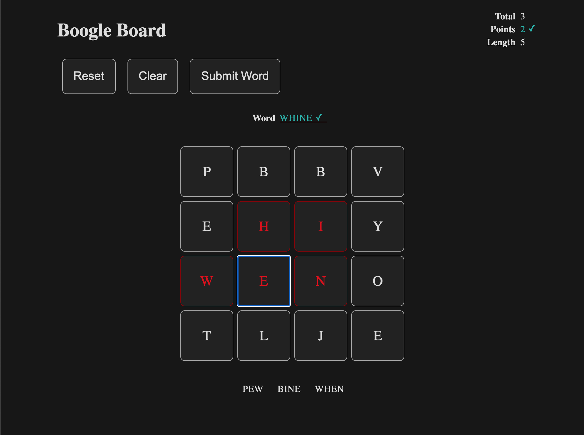

# JS-HTML-Games: Boogle Board
A word-search game

## [Play Now!](https://picaq.github.io/JS+HTML-Games/)

## Todo
- [ ] highlight matching word in word bank
- [ ] turn red highlighted buttons green when a valid word can be submitted
- [ ] SEO?
- [ ] add info page and link back to repository
- [ ] convert into pwa?
- [ ] create a light mode and toggle
